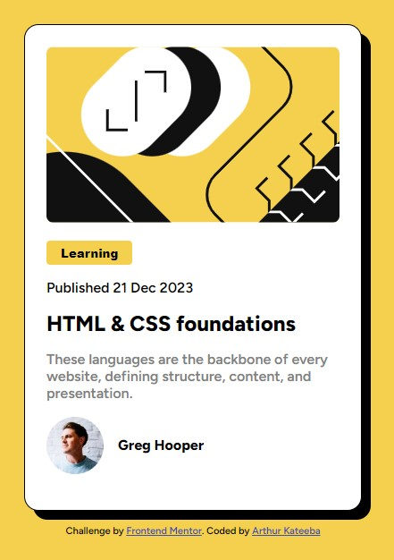

# Frontend Mentor - Blog preview card solution

This is a solution to the [Blog preview card challenge on Frontend Mentor](https://www.frontendmentor.io/challenges/blog-preview-card-ckPaj01IcS). Frontend Mentor challenges help you improve your coding skills by building realistic projects. 

## Table of contents

- [Overview](#overview)
  - [The challenge](#the-challenge)
  - [Screenshot](#screenshot)
  - [Links](#links)
- [My process](#my-process)
  - [Built with](#built-with)
  - [What I learned](#what-i-learned)
  - [Continued development](#continued-development)
- [Author](#author)
- [Acknowledgments](#acknowledgments)

**Note: Delete this note and update the table of contents based on what sections you keep.**

## Overview

### The challenge

Users should be able to:

- See active state on the interactive element(s) on the card.

### Screenshot



### Links

- Solution URL: [Add solution URL here](https://github.com/ArthKate/fmc-blog-preview--card.git)
- Live Site URL: [Add live site URL here](https://arthkate.github.io/fmc-blog-preview--card/)

## My process

### Built with

- Semantic HTML5 markup
- CSS custom properties

### What I learned

- I have learned how to pseudo classes to toggle states on a link.
- I have also learned how to apply shadows particularly the box-shadow for this project.


```html
<h1>Some HTML code I'm proud of</h1>
```
```css
  a:hover
  a:active {
    color: var(--yellow);
    transition: all 0.02s ease-in;
  }
```


If you want more help with writing markdown, we'd recommend checking out [The Markdown Guide](https://www.markdownguide.org/) to learn more.

**Note: Delete this note and the content within this section and replace with your own learnings.**

### Continued development

Am going to focus on learning css to be conversant with responsive web development in order to appreciate css frameworks that I might later use in my learning journey to be come a fullstack web developer 


## Author

- Website - [Arthur Kateeba](https://www.your-site.com)
- Frontend Mentor - [@ArthKate](https://www.frontendmentor.io/profile/yourusername)
- Twitter - [@arthurkateeba](https://www.twitter.com/yourusername)

**Note: Delete this note and add/remove/edit lines above based on what links you'd like to share.**

## Acknowledgments

(https://www.w3schools.org) for teaching me how to use box-shadow css propoerty.